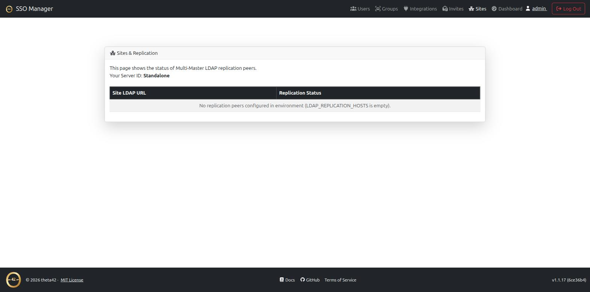

# Theta Directory

A production-grade, self-hosted **OpenID Connect provider**, **Resource Directory & IAM Engine**, and bundled **OpenLDAP directory** with a modern web console — designed for home-labs and enterprise infrastructure that demand total sovereignty over their identity, secrets, and resource catalog.

It provides a single source of truth for identity (OIDC + LDAP), host/service directory inventory, access control groups, and secrets management running entirely on your own hardware without third-party cloud lock-in.

Theta Directory is deployed as part of [Theta Suite](https://github.com/theta42/theta-suite),
alongside [Theta Proxy](https://github.com/theta42/proxy) and
[Theta Gateway](https://github.com/theta42/jump-host) — it isn't installed or
run on its own. `./setup.sh` wires the whole stack together automatically.

**Documentation:** [https://theta42.github.io/theta-suite/sso/](https://theta42.github.io/theta-suite/sso/)

## Screenshots

| Dashboard | Users |
| --- | --- |
| [](docs/images/dashboard.png) | [](docs/images/users.png) |

| Groups | OAuth Apps |
| --- | --- |
| [](docs/images/groups.png) | [](docs/images/oauth-clients.png) |

| Sites & Replication |
| --- |
| [](docs/images/sites.png) |

| Agent Capabilities & Metrics | Agent Install (Join Key) |
| --- | --- |
| [](docs/images/agent-capabilities-metrics.png) | [](docs/images/agent-install-join-key.png) |

## Features

- **OpenID Connect / OAuth 2.0 provider** — issue your own access, refresh, and
  ID tokens; protect your apps with standard OIDC login. Discovery document at
  `/.well-known/openid-configuration`.
- **Bundled OpenLDAP directory** — users, groups, POSIX accounts
  (`posixAccount`/`inetOrgPerson`), SSH public keys, and sudo roles, with
  `memberOf` + referential-integrity overlays. This is your single source of
  truth for identity, not a sidecar.
- **Web management UI** — manage users, groups, and OAuth clients from a
  browser; invite and password-reset flows over email; user self-service for
  profile and API tokens.
- **Direct LDAP binds** — Linux hosts (PAM/SSSD login, LDAP-backed `sudo`
  rules, SSH public keys via openssh-lpk) and LDAP-native apps (Gitea, Emby,
  and anything else that speaks LDAP) use LDAPS (636) or StartTLS against the
  same directory, so you don't maintain a second user database for them.
- **Personal access tokens** — any user can mint a long-lived bearer token to
  drive the management API from scripts or CI, scoped to their own permissions.
- **Directory & Inventory Graph** — full host/service/site graph with resource metadata, automatic LDAP group provisioning (`_access` / `_admin`), and Access Request workflows.
- **Subtype Management & Metrics Drivers Engine** — 4-tier resolution engine binding `subType` metadata (`systemd`, `docker`, `proxmox`, `wireguard`, `postgresql`, `redis`, `k8s`) to operational telemetry, log streaming, and remote lifecycle control.
- **Explicit Secret Inheritance Mode** — OpenBao KV-v2 integration with strict upward ancestor lineage (`Resource -> Host -> Cluster -> Site`), preserving precise secret scoping across services and containers.
- **Multi-Site Support (Geo-Location Scaling)** — built-in support for N-Way Multi-Master OpenLDAP replication across physical sites for HA and low latency.

## Secrets

Secrets are loaded from **OpenBao** at boot via
[@simpleworkjs/bao-conf](https://simpleworkjs.github.io/bao-conf/), which
deep-merges `secret/sso-manager/conf` over the file-loaded config (fail-soft:
if OpenBao is unreachable, boot continues from `CONF_SECRETS`). The SSO
authenticates to OpenBao with the scoped `VAULT_TOKEN` (env, policy
`sso-broker`) — never the root token.

The SSO also acts as the **vault broker** for the whole stack: it mints
per-user (`user-<uid>`) and per-admin (`sso-admin`) tokens through the
`sso-broker` token role and exposes the personal-secrets UI at **Vault → My
Secrets** (`secret/users/<uid>/*`, server-side token injection + path-scope
guard) and an admin **Apps** tab to mint scoped tokens for external apps
(`secret/apps/<name>/*`). The old `utils/conf_manager.js` was replaced by
`@simpleworkjs/bao-conf`; the admin **Configuration** UI (`/api/conf`) now
writes `secret/sso-manager/conf` through `bao-conf.set`.

The `config/*-secrets.js` files are operator-edit seed artifacts (gitignored),
not the authoritative store. For the full architecture, policies, token model,
and rotation procedure, see theta-suite's
**[Secrets docs](https://theta42.github.io/theta-suite/secrets.html)**.

## Architecture

```
┌─────────────┐
│  Browser /  │
│  OIDC apps  │
└──────┬──────┘
       │ HTTP/HTTPS
       ▼
┌────────────────────────┐      ┌─────────────┐
│  Theta Directory       │◄────►│   Redis     │
│  - OIDC provider       │      │ - sessions  │
│  - web UI (:3001)      │      │ - models    │
│  - management API      │      └─────────────┘
└────────┬───────────────┘
         │ ldapi/ldap (localhost)
         ▼
┌────────────────────────┐
│  OpenLDAP (slapd)      │
│  - users / groups      │
│  - LDAPS :636          │─── Linux hosts + LDAP apps bind directly
│  - StartTLS :389       │
└────────────────────────┘
```

## Documentation

The nitty LDAP details (overlay setup, the custom `theta42Person` schema, the
required groups, LDAPS/TLS, direct-bind service accounts) live in:

- [DEPLOYMENT.md](DEPLOYMENT.md) — Docker + bare metal, the config layers, the
  `app_*` env reference, LDAPS/TLS, backups, troubleshooting.
- [API.md](API.md) — the management API.
- [docs/](docs/) — the same content broken into
  [OAuth/OIDC](docs/oauth.md) and [LDAP](docs/ldap.md), also published at the
  unified [theta-suite docs site](https://theta42.github.io/theta-suite/sso/).
- [CHANGELOG.md](CHANGELOG.md) — what changed in each release.
- All of the above is also readable from the running app itself at `/docs` —
  no internet access required.


## License

MIT — see [LICENSE](LICENSE).
