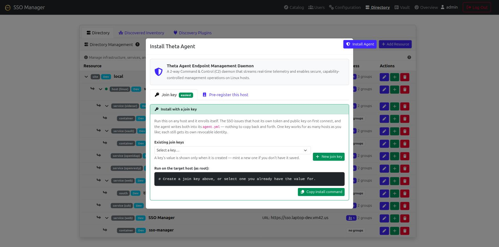

# Theta Agent & Endpoint Management

The **Theta Agent** (`theta-agent`) is a unified, 2-way Command & Control (C2) endpoint management daemon written in Go with native cross-platform binaries for **Linux (x86_64, ARM64, ARMv7)**, **Windows (x86_64, ARM64)**, and **macOS (Intel, Apple Silicon M1/M2/M3/M4)**. It connects outbound via a long-lived WebSocket connection to the central **SSO Manager** (`wss://<sso-host>/api/agent/ws`), enabling real-time host telemetry, automated host discovery, and local-first administrative management.

---

## Supported Architectures & Operating Systems

The agent is compiled for 7 target platform binaries with zero external runtime dependencies:

| Operating System | Architecture | Binary Name | Typical Target Devices |
| :--- | :--- | :--- | :--- |
| **Linux** | `amd64` (x86_64) | `theta-agent-linux-amd64` | Intel/AMD Servers, Cloud VMs, Proxmox Hypervisors |
| **Linux** | `arm64` (aarch64) | `theta-agent-linux-arm64` | Raspberry Pi 4/5, Graviton, Ampere Altra |
| **Linux** | `armv7` (32-bit ARM) | `theta-agent-linux-armv7` | Raspberry Pi 2/3/Zero 2W, ARM IoT Gateways |
| **Windows** | `amd64` (x86_64) | `theta-agent-windows-amd64.exe` | Windows Server, Windows 10/11 Desktop |
| **Windows** | `arm64` | `theta-agent-windows-arm64.exe` | Windows on ARM, Surface Pro |
| **macOS** | `amd64` | `theta-agent-darwin-amd64` | Intel Macs |
| **macOS** | `arm64` | `theta-agent-darwin-arm64` | Apple Silicon Macs (M1/M2/M3/M4) |

The `install.sh` script automatically detects `uname -s` and `uname -m` to download the exact binary for the host.

---

## Enrollment

An agent is only real if the SSO issued its credential. **Tokens the server did
not issue are rejected** at the WebSocket handshake.

There are two ways to get a host enrolled, and the first is the normal one.

### Join key — install the agent and the host appears

Hand the machine a **join key** and nothing else. On first connect the SSO
enrolls the host, issues it its own per-agent token plus the public key it must
pin, and the agent **writes both into its own `agent.yml`** and blanks the join
key. From then on it authenticates as itself.

```bash
curl -fsSL https://<SSO_HOST>/resources/theta-agent/install.sh | sh -s -- \
  --url "https://<SSO_HOST>" --join-key "tjk_..."
```

That is the whole procedure — no pre-registering the machine, no copying a
public key by hand. `setup.sh` mints a key and configures the stack's own host
this way automatically.

The join key is a *bootstrap* credential, not the host's identity. That
distinction is what keeps one key convenient without making it a fleet-wide
skeleton key: every host still ends up individually revocable, and a compromised
host does not yield a credential that works anywhere else.

| Endpoint | Purpose |
| :--- | :--- |
| `GET /api/agent/join-keys` | List keys (prefix + usage only; never the key) |
| `POST /api/agent/join-keys` | Mint one — returned **once** |
| `POST /api/agent/join-keys/:id/revoke` | Stop it enrolling new hosts |
| `DELETE /api/agent/join-keys/:id` | Remove it |
| `GET /api/agent/join-keys/:id/agents` | Which hosts enrolled through this key |

Revoking a join key does **not** disconnect hosts that already joined; they hold
their own tokens by then. Revoke the agent itself to cut a specific host off.

**Reuse.** Yes — a join key is not consumed on use. `AgentJoinKey.authenticate`
only checks `revoked` and `expires_on`; it never invalidates the key itself.
Every use increments `use_count` and stamps `last_used_on`, but the key keeps
working until you revoke or delete it (or it expires) — "one key works for as
many hosts as you like" above is literal, not a figure of speech.

**UI.** The **Install Agent** modal (Directory → Install Agent → Join key tab)
has a **Manage join keys** table below the mint/select dropdown: label, prefix,
created date, hosts joined, status, and **Revoke**/**Delete** actions per key.
Clicking a key's "N hosts" link expands the list of hosts that joined through
it (name, online status, joined date, last seen).

**Audit.** Yes, both halves are logged as structured `"component":"agent"`
lines, and the hosts-joined list in the UI above is queryable directly:
- Minting: `action: "join_key_issued"` records the acting admin (`actor`),
  `label`, and `keyPrefix`.
- Each enrollment through that key: `action: "join"` records `agentId`,
  `agentName`, `remoteAddr`, `joinKeyLabel`, and `joinKeyPrefix`.
- `GET /api/agent/join-keys/:id/agents` returns the same "which hosts did key
  X add" answer the UI shows — it matches on the trace `Agent.enroll` leaves in
  each agent's `description` ("Self-enrolled with join key `<prefix>`") rather
  than a stored foreign key, since a join key is exchanged for a per-agent
  token immediately and from then on the agent's own identity is what matters.

### Pre-registering a host

When you want the agent bound to a specific Directory host up front, enroll it
from **Directory → Install Agent**:

1. Give the agent a name and **bind it to a host resource**. The binding is what
   links telemetry, status and commands to a Directory entry.
2. Press **Enroll & issue token**. The SSO mints a 256-bit token, stores only its
   SHA-256, and shows the raw value **once**.
3. Copy the generated install command — it already carries the token and the
   server's public key.

A host that self-enrolls with a join key arrives unbound; bind it afterwards with
`PUT /api/agent/nodes/:id` or from the Directory.

Or via the API:

```bash
curl -X POST https://<SSO_HOST>/api/agent/enroll \
  -H "Authorization: Bearer <admin-api-token>" \
  -H 'Content-Type: application/json' \
  -d '{"name": "web01", "resourceId": "<host-resource-uuid>"}'
```

The response contains `token` (once only) and `publicKey`.

| Endpoint | Purpose |
| :--- | :--- |
| `GET /api/agent/nodes` | Every enrolled agent, connected or not, plus the server public key |
| `POST /api/agent/enroll` | Mint an agent + token |
| `PUT /api/agent/nodes/:id` | Rename, or bind/unbind the host resource |
| `POST /api/agent/nodes/:id/rotate` | Issue a new token; the old one stops working immediately |
| `POST /api/agent/nodes/:id/revoke` | Disable the enrollment |
| `DELETE /api/agent/nodes/:id` | Remove the enrollment |
| `POST /api/agent/nodes/:id/command` | Send a command (signed automatically when high-risk) |

Revoke, rotate and delete **drop any live connection immediately** — they do not
wait for the agent to reconnect. Commands are addressed by agent **id**, never by
token: a token is a credential and has no business in a URL or a log.

Enrollment, revocation, rotation, every command, and every rejected connection
are written to the application log as structured `"component":"agent"` records
with the acting user.

> **Lost the token?** It cannot be recovered — only its hash is stored. Rotate
> the agent to issue a new one.

---

## Core Functionality

### 1. Host Discovery & Inventory
Upon establishing a WebSocket connection, the agent immediately pushes a comprehensive discovery payload:
- **Hostname & Network Interfaces**: Hostname and all non-loopback IPv4 addresses and MACs.
- **Operating System & Kernel**: Linux distribution, platform, and kernel version.
- **Hardware Specs**: CPU model, total RAM (GB), and total root disk capacity (GB).
- **Physical Location**: Location identifier string (e.g. `dc-01-rack-12`) configured in `agent.yml`.

If the agent detects a network IP change, it automatically re-pushes an updated discovery payload to the SSO Manager.

### 2. Real-Time Telemetry Streaming
Every 30 seconds, the agent streams real-time performance metrics:
- **CPU Load**: System-wide CPU utilization percentage.
- **Memory Utilization**: RAM usage percentage and available memory.
- **Disk Utilization**: Root filesystem usage percentage.
- **ZFS Storage Health**: Health status of ZFS pools (e.g., `ONLINE`).
- **NVIDIA GPU Load**: GPU compute utilization percentage (via `nvidia-smi`).

---

## Viewing in the SSO Manager

Agent status and telemetry live on the **Directory** page — there is no separate
Agents page. For each **host** resource that has a connected theta-agent, the
Directory shows a status dot in the row:

| Color | Meaning |
| :--- | :--- |
| **Green** | Connected, healthy (CPU/RAM/disk within limits). |
| **Yellow** | Connected but under high load (CPU > 80% or RAM > 80% or disk > 90%). |
| **Red** | **Enrolled but not connected.** The agent exists and is expected — this is a fault. |
| **Grey** | No agent enrolled for this host, the enrollment is revoked, or the agent service is unreachable. |

Red and grey used to be the same colour, which made an ordinary directory of
hosts look like an outage. Because the enrollment now outlives the connection,
"installed but down" is distinguishable from "never had an agent".

Opening a host's resource modal reveals a **Metrics** tab with the agent's live
telemetry (CPU/RAM/disk/ZFS/GPU) and discovery info (OS, kernel, IPs, location).

An agent attaches to its host by its **enrollment binding** (`resourceId`), set
when you enroll it or later via `PUT /api/agent/nodes/:id`. Agents enrolled
without a binding fall back to matching their reported hostname against the
resource name — the old behaviour, kept only as a fallback, because it silently
failed whenever a Directory name differed from the machine's hostname and
aliased two hosts that happened to share one.

### Agent discovery feeds the Directory

A bound agent's discovery payload is written onto its host resource (`os`,
`kernel`, `cpu`, `ram_total_gb`, `disk_total_gb`, `ip`), tagged with
`discovery_sources: ["theta-agent"]` and an `agentId` back-reference. An agent
runs *on* the host it describes, so it is the most authoritative source the
directory has. An unbound agent goes through the normal discovery reconciler
instead, matching like any other source.

---

## Local-First Security & Capability Matrix

To protect hosts against unauthorized control, `theta-agent` enforces a **strict, local-first capability matrix** defined in `/etc/theta42/agent.yml`. Central SSO Manager requests are checked against local configuration before execution; permissions cannot be overridden remotely.

| Capability | Config Key | Risk Level | Description & Impact |
| :--- | :--- | :--- | :--- |
| **Telemetry** | `telemetry` | Safe | Streams read-only system metrics (CPU, RAM, Disk, ZFS, GPU). |
| **Configure LDAP** | `configure_ldap` | Moderate | Writes updated SSSD configuration to `/etc/sssd/sssd.conf` & restarts `sssd`. |
| **Service Control** | `service_control` | High | Restarts systemd services listed in an explicit allowlist (e.g., `["nginx", "docker", "sssd"]`). |
| **Reboot** | `reboot` | High | Triggers an immediate system reboot (`systemctl reboot`). |
| **Arbitrary Bash** | `arbitrary_bash` | Critical | Executes raw bash scripts sent from the SSO Manager as `root` (used for automated GitOps). |
| **LDAP Tunnel** | `ldap_tunnel` | Moderate | Serves a local LDAP byte-pump socket (`ldap_socket`, default `/run/theta/ldap.sock`) for SSSD/PAM. The agent never parses LDAP — it forwards raw bytes to the SSO, which relays them into its own OpenLDAP. |
| **Secrets** | `secrets` | Moderate | Renders OpenBao secrets to local files from templates (see [Secrets Engine](#secrets-engine---rendering-openbao-secrets-to-local-files) below). |
| **IAM** | `iam` | Critical | Applies SSO-pushed node identity config: sudo rules, SSH `AuthorizedKeysCommand` keys, `/etc/security/access.conf`, and revocation (`sss_cache -E` + session kill). Every push is Ed25519-signed. |

---

## High-Risk Command Verification (Protocol v1.2.0)

High-risk management commands (`reboot`, `service_restart`, `configure_ldap`, `arbitrary_bash`, `update_binary`) are cryptographically verified using **Ed25519 signatures**:
1. The SSO Manager canonicalizes the command payload (sorted keys, no whitespace,
   no HTML escaping, `signature` omitted).
2. The payload is signed with the SSO Manager's Ed25519 private key.
3. The Base64 signature is appended to the message payload.
4. The agent verifies the signature against the configured `public_key` in `/etc/theta42/agent.yml` before executing the action.

**The signing key is persistent.** It lives in OpenBao at
`secret/agent/signing-key` and survives restarts, so the `public_key` you pin in
`agent.yml` keeps matching. (It used to be generated in memory at boot and
changed on every restart, which made pinning impossible.) If the SSO cannot load
or store a key it **refuses** to send high-risk commands rather than signing with
one no agent has seen — `GET /api/agent/nodes` reports this as
`signingAvailable: false`.

This requires the `sso-broker` OpenBao policy to grant `secret/agent/*`. Re-run
`./setup.sh` from theta-suite if you are upgrading.

**Verification is fail-closed on the agent.** An agent with no `public_key`
configured rejects every high-risk command. Earlier versions logged "skipping
signature verification" and executed them, so an agent installed without a key
would run `reboot`, `configure_ldap` and `arbitrary_bash` unverified.

---

## Secrets Engine — rendering OpenBao secrets to local files

The agent can render OpenBao secrets to local files that any process on the
host — a bash script, a systemd unit, a Node app, whatever — reads like an
ordinary env file. The agent never holds a Vault token: it asks the SSO for the
values over its existing WSS channel, and the SSO fetches them from OpenBao
using its own access, scoped so the agent can only ever read its own node's
secrets.

**Node scope.** Every path an agent can request must start with
`secret/data/nodes/<this-agent's-id>/`. The SSO enforces this server-side
(`POST /api/v1/agent/secrets`); a request for any other node's path is
rejected:

```
$ curl -sk https://sso.example.com/api/v1/agent/secrets \
    -H "Authorization: Bearer <agent-token>" -H 'Content-Type: application/json' \
    -d '{"paths":["secret/data/nodes/some-other-node-id/db"]}'
{"status":"error","message":"path outside node scope: secret/data/nodes/some-other-node-id/db"}
```

A compromised agent can therefore never reach another host's secrets, or
anything outside `secret/data/nodes/*`.

### Walkthrough: a 3rd-party app reads a secret the agent rendered

This walks through the whole path end to end, on a stack freshly brought up
from theta-suite's own `docs/fixtures.md` demo data — the same steps work on
any theta-suite install.

**1. Enroll the host.** Directory → Install Agent → mint a join key, run the
install command on the target host as root.

<a href="images/agent-install-join-key.png" target="_blank"></a>

On first connect the agent exchanges the join key for its own token + the
SSO's public key and writes both back into `/etc/theta42/agent.yml`. Note the
agent's id from `GET /api/agent/nodes` (or the Directory URL) — you need it for
the next step.

**2. Turn on the `secrets` capability and point it at a template.** Add to the
host's `/etc/theta42/agent.yml`:

```yaml
secrets:
  - template: /etc/theta/templates/db.env.tpl
    target: /etc/theta/rendered/db.env
    reload: ""          # optional: e.g. "systemctl reload myapp"

capabilities:
  secrets: true
```

And the template itself, `/etc/theta/templates/db.env.tpl` — placeholders are
`{{ bao "secret/data/nodes/<agent-id>/<name>#<key>" }}`:

```
DB_USER="{{ bao "secret/data/nodes/f9a30ab0-7d8a-4b77-a4c4-6a6383d084db/db#username" }}"
DB_PASS="{{ bao "secret/data/nodes/f9a30ab0-7d8a-4b77-a4c4-6a6383d084db/db#password" }}"
```

Restart the agent to pick up the config change.

**3. Seed the secret.** From `theta-suite/` (theta-env), as the operator:

```
./setup.sh --seed-node-secret f9a30ab0-7d8a-4b77-a4c4-6a6383d084db db \
  username=demoapp password=CorrectHorseBattery42
```

This writes to `secret/nodes/<agent-id>/db` in OpenBao (the CLI path — the HTTP
API the agent uses sees it as `secret/data/nodes/<agent-id>/db`, matched by the
node-scope check above). It's idempotent: it skips silently if that path is
already seeded.

**4. Trigger the render.** The Directory UI doesn't have a button for this yet
— push it the same way any admin command goes out, `POST
/api/agent/nodes/:id/command`. It's in the high-risk list, so the SSO signs it
automatically:

```
curl -X POST https://sso.example.com/api/agent/nodes/f9a30ab0-7d8a-4b77-a4c4-6a6383d084db/command \
  -H "auth-token: <admin session token>" -H 'Content-Type: application/json' \
  -d '{"command": "render_secrets", "payload": {}}'
```

The agent logs `Received command: render_secrets` / `Rendering secret
templates...` and atomically writes the target file at mode `0600`:

```
$ cat /etc/theta/rendered/db.env
DB_USER="demoapp"
DB_PASS="CorrectHorseBattery42"
```

Back in the Directory, the host's Metrics tab shows **Secrets** lit up green
among the reported capabilities:

<a href="images/agent-capabilities-metrics.png" target="_blank"></a>

**5. Read it from a bash app on the same host.** The rendered file is just an
env file — no agent involvement needed to consume it:

```sh
#!/bin/sh
. /etc/theta/rendered/db.env
echo "DB_USER=$DB_USER"
echo "DB_PASS=$DB_PASS"
```

**6. Read it from a Node app on the same host:**

```js
const fs = require('fs');
const env = fs.readFileSync('/etc/theta/rendered/db.env', 'utf8');
const db = {};
for (const line of env.split('\n')) {
  const m = /^(\w+)="(.*)"$/.exec(line.trim());
  if (m) db[m[1]] = m[2];
}
console.log('DB_USER=' + db.DB_USER);
console.log('DB_PASS=' + db.DB_PASS);
```

Both print the same values the template resolved — `demoapp` /
`CorrectHorseBattery42` in this walkthrough. `theta-agent/demo/` in the
theta-agent repo has these two scripts ready to run.

### Alternative: calling the API directly

Rendering to a file is the normal path — it works for any app regardless of
language, and the secret never touches an HTTP client the app itself controls.
But an app can also fetch its node's secrets directly, bypassing the template
engine entirely (useful for debugging, or a process that wants to hold the
value only in memory). This uses the **agent's own bearer token**, not an admin
token — the same node-scope enforcement applies:

```sh
curl -sk https://sso.example.com/api/v1/agent/secrets \
  -H "Authorization: Bearer <agent-token>" -H 'Content-Type: application/json' \
  -d '{"paths":["secret/data/nodes/f9a30ab0-7d8a-4b77-a4c4-6a6383d084db/db"]}'
```

```js
const token = process.env.THETA_AGENT_TOKEN; // from /etc/theta42/agent.yml
fetch('https://sso.example.com/api/v1/agent/secrets', {
  method: 'POST',
  headers: { Authorization: 'Bearer ' + token, 'Content-Type': 'application/json' },
  body: JSON.stringify({ paths: ['secret/data/nodes/f9a30ab0-7d8a-4b77-a4c4-6a6383d084db/db'] })
}).then(r => r.json()).then(d => console.log(d.secrets));
```

Both return:

```json
{
  "status": "ok",
  "secrets": {
    "secret/data/nodes/f9a30ab0-7d8a-4b77-a4c4-6a6383d084db/db": {
      "username": "demoapp",
      "password": "CorrectHorseBattery42"
    }
  }
}
```

---

## Installation & Deployment

### Quick One-Liner Install
Run the following command as `root` on the target Linux host:

```bash
curl -fsSL https://<SSO_HOST>/resources/theta-agent/install.sh | sh -s -- \
  --url "https://<SSO_HOST>" --token "<ISSUED_TOKEN>" --public-key "<BASE64_PUBLIC_KEY>"
```

Both values come from enrollment. The **Install Agent** modal builds this line
for you with them already filled in. Omitting `--public-key` leaves the agent
able to report telemetry but unable to accept any high-risk command.

### Custom Config Wizard
You can generate a Base64-encoded custom configuration using the **Install Agent** button on the **Directory Management** page in the SSO Manager UI:

```bash
curl -fsSL https://<SSO_HOST>/resources/theta-agent/install.sh | sh -s -- "<BASE64_ENCODED_CONFIG>"
```

---

## Configuration File Example (`/etc/theta42/agent.yml`)

```yaml
# /etc/theta42/agent.yml
server_url: "wss://sso.example.com"
# Issued by the SSO. Left empty when installing with a join key -- the agent
# fills it in itself once the server enrolls it.
auth_token: "c8181ce0e55bf7302b11d719a7ae39adcd7604de461e6e363f8bb4fadf126acb"
# Bootstrap credential. Used only while auth_token is empty, and blanked by the
# agent once it has its own token.
join_key: ""
location: "dc-01-rack-12"
# Base64 of the RAW 32-byte Ed25519 public key -- exactly the `publicKey` value
# from enrollment or GET /api/agent/nodes. Not a PEM body: a base64-decoded
# SPKI blob is 44 bytes, the agent requires 32, and it will refuse every signed
# command if this is wrong.
public_key: "D0cJB3iuStTzhXlu7tFDh/eEXFxRZwkuwQJJhFSqwlQ="

capabilities:
  telemetry: true
  configure_ldap: true
  reboot: false
  service_control: ["nginx", "docker", "sssd"]
  arbitrary_bash: false
```

---

## Troubleshooting: agent is rejected (`close 4001`)

If the agent logs that the server rejected its token, the enrollment — not the
network — is the problem. The SSO accepts the WebSocket upgrade and then closes
with an application code:

| Code | Meaning | Fix |
| :--- | :--- | :--- |
| `4001` | Token unknown, or never issued by this server | Enroll the host and put the issued token in `agent.yml` |
| `4002` | Superseded — another connection authenticated as this agent | Normal; two copies of the agent are running |
| `4003` | Enrollment revoked or deleted | Re-enroll |
| `4004` | Token rotated; `agent.yml` has the old value | Copy the new token |

The agent backs off for 5 minutes on `4001`/`4003`/`4004` rather than retrying
every 5 seconds — a credential that is wrong will not fix itself, and hammering
the SSO only floods its audit log.

An agent installed before protocol v1.2.0 carries a token generated in the
browser that the server never recorded, so it will be rejected with `4001` until
re-enrolled. The quickest fix is to put a **join key** in its `agent.yml` as
`join_key` and blank `auth_token` — it will re-enroll itself on the next
reconnect.

---

## Troubleshooting: agent can't connect (`dial tcp ... i/o timeout`)

If the agent host logs `Dial error: dial tcp <ip>:443: i/o timeout` while
connecting to `wss://<sso-host>/api/agent/ws`, the WebSocket path is usually
fine — this is a **network/NAT** problem, not an agent or SSO bug. A host behind
the same NAT that owns the SSO often cannot reach its own **public IP** (no
hairpin/loopback NAT on many home routers), so the TCP dial times out even
though the same address works from outside.

Fix options:
1. Point `agent.yml` `server_url` at an address the host can reach directly —
   e.g. the SSO host's LAN IP (`http://<lan-ip>` or `http://<lan-ip>:3001` for a
   no-TLS direct path).
2. Enable **NAT reflection / hairpin NAT** on the router so LAN hosts can reach
   their own public IP:443.
3. Add a local route/firewall rule on the agent host for its public IP.

> Note: on a deployment where the theta42 proxy fronts `sso.suite.example`, make
> sure the proxy has a **persistent Host record** for the real SSO domain — not
> just the `localtest.me` placeholder — so routing survives a proxy restart
> (an in-memory lookup cache can mask a missing Redis record for up to ~1h).
