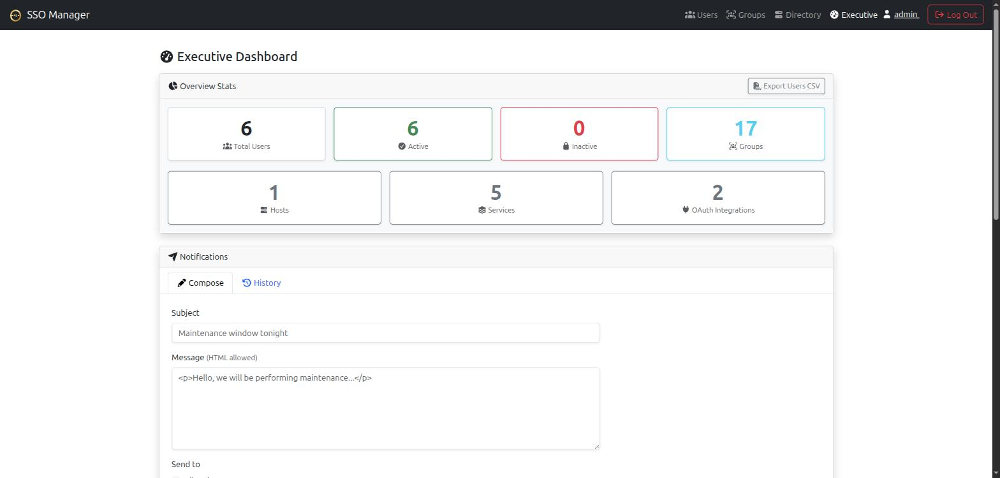
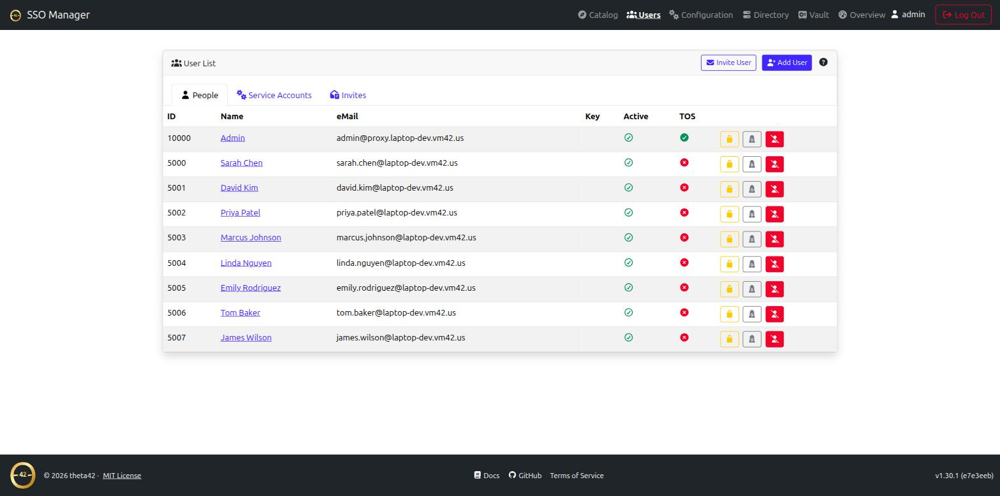
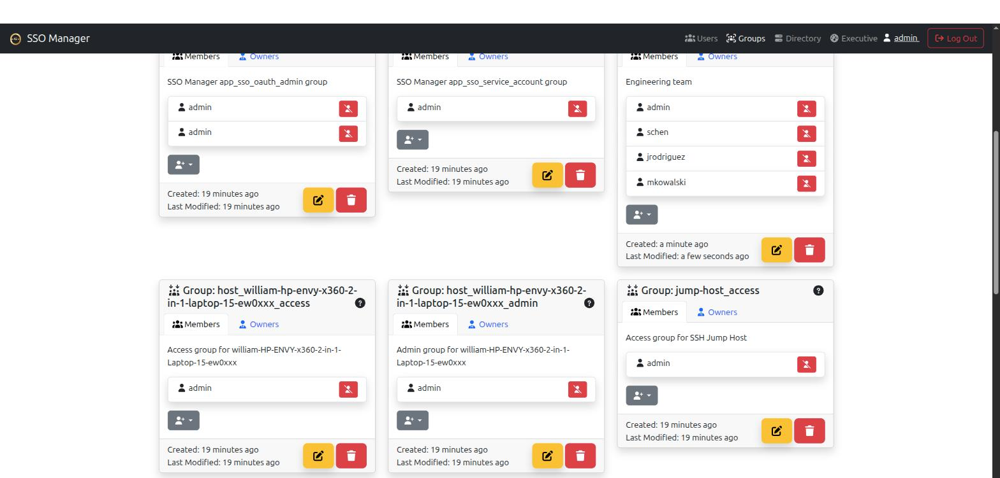
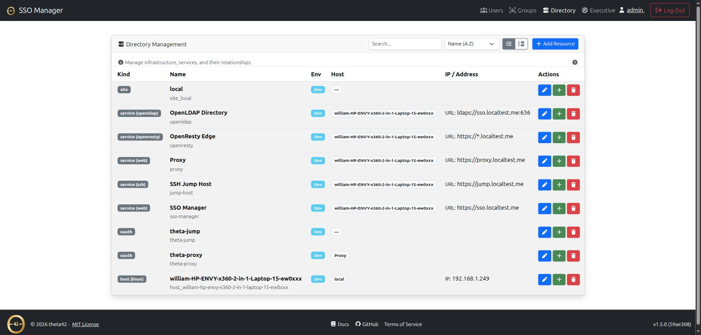
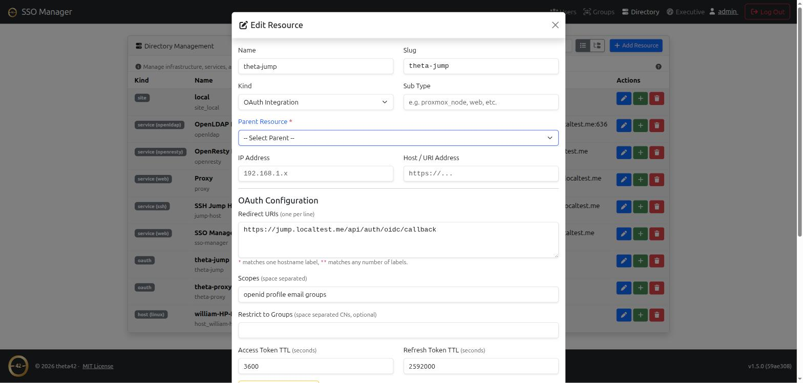

# SSO Manager

A self-hosted **OpenID Connect provider** with a bundled **OpenLDAP directory**
and a web management UI — for home labs and small businesses that want their
own identity provider instead of a hosted one.

One place to manage your users and groups, one login (OIDC) your modern apps
can use, and one LDAP directory your older or odder apps can bind to directly.
Everything runs on your own hardware; no phone-home, no hosted control plane,
no per-user pricing.

Part of the theta42 self-hosted identity stack, alongside
[Proxy](https://theta42.github.io/proxy/) (an OIDC + LDAP-aware reverse proxy)
and [theta-env](https://theta42.github.io/theta-env/) (the two composed with
one command).

## Screenshots

<a href="images/dashboard.png" target="_blank"></a>
<a href="images/users.png" target="_blank"></a>
<a href="images/groups.png" target="_blank"></a>
<a href="images/directory.png" target="_blank"></a>
<a href="images/oauth-clients.png" target="_blank"></a>

*(click any screenshot to view full size)*

## Why this over the alternatives

Tools like Keycloak, Authentik, Authelia, or Zitadel are OIDC providers, but
LDAP is either a paid feature, a federation target you have to run
separately, or absent. If your stack already has apps that speak LDAP
directly — or you just want one real directory as the source of truth — you
end up running *two* identity systems and keeping them in sync.

SSO Manager bundles the OpenLDAP directory with the OIDC provider, so OIDC
apps and LDAP apps read from the same users and groups. The trade-off is
scope: it's intentionally small and self-hosted, not an enterprise IAM suite.
If you want a lightweight, self-contained identity provider with a real LDAP
backend, that's the niche.

## Features

- **OpenID Connect / OAuth 2.0 provider** — your own access/refresh/ID
  tokens; standard discovery document at `/.well-known/openid-configuration`.
- **Bundled OpenLDAP directory** — users, groups, POSIX accounts, SSH public
  keys, and sudo roles, with `memberOf` + referential-integrity overlays.
- **Web management UI** — users, groups, and OAuth clients from a browser;
  invite and password-reset flows over email; self-service profile + API
  tokens.
- **Direct LDAP binds** — anything that binds LDAP directly (Linux hosts
  via PAM/SSSD, Gitea, Emby, …) uses LDAPS/StartTLS against the same
  directory.
- **All-in-one Docker image** — app + OpenLDAP + Redis in one container, or
  run the pieces separately via `app_*` env config.
- **Geo-Location Scaling** — built-in support for N-Way Multi-Master OpenLDAP [replication](replication.html) across physical sites.
- **[Directory & Inventory](directory.html)** — map sites, hosts, and services as a graph with rich metadata (IP/MAC, OS/kernel, ports, git repos), auto-provisioned access groups, and automatic registration from theta-env and ldap-client. Drives directory-aware tools like the [SSH jump host](https://theta42.github.io/jump-host/).
- **[Discovery](discovery.html)** — the catalog-vs-discovered distinction, how scanned assets are matched/merged into existing resources, and how a discovery gets promoted into the catalog (and becomes reachable through the jump host).
- **[Writing Discovery Plugins](discovery-plugins.html)** — the plugin contract: the closed `kind` vocabulary, why an omitted subtype is a security problem, timeouts and queue isolation, and what the platform cleans up for you.
- **[Access Inheritance](access-inheritance.html)** — ownership propagates down the resource tree: granting someone a site grants them what is in it, why grants are additive with no deny, and how to tell an inherited grant from a direct one.
- **[Subtype Templates](subtype-templates.html)** — data-driven resource types: what a `linux` host or a `port-forward` service is, which fields it has, where in the tree it may go, and how those templates replicate across sites.
- **[Status Rules](status-rules.html)** — how a resource's health dot is computed from telemetry, plugin state and the environment bubbled up from its children, and the small expression language that says so.
- **[Resource Facts](resource-facts.html)** — the canonical vocabulary a plugin/driver must use for a fact to be found across sources, the additive per-source echo that lets two sources' values survive side by side, and how a host's Status tab meshes its own facts with its children's.
- **[Theta Agent & Endpoint C2](agents.html)** — 2-way Go daemon (`theta-agent`) for real-time telemetry (CPU, RAM, Disk, ZFS, GPU), automated host discovery, SSSD/LDAP configuration, and local capability-controlled management operations.
- **[Vault secrets](vault.html)** — an OpenBao-backed key-value store built into the UI, for stashing passwords/API keys/credentials with encryption and access control.
- **[API tokens](concepts-api-tokens.html)** — self-service personal access tokens for calling the management API from scripts/CI without a browser session.
- **[The site network](network.html)** — the WireGuard cluster: sites, per-user device VPN, LAN mapping and internet exits, all keyed off the site id that multi-site join allocates.
- **[Importing an existing directory](ldif-import.html)** — migrate users and group memberships from an LDIF export of an existing LDAP server, keeping every `uidNumber`, `gidNumber` and password hash intact.

## Get it

```bash
git clone https://github.com/theta42/sso-manager-node.git
cd sso-manager-node
cp secrets.js.example nodejs/conf/secrets.js   # edit it, or use app_* env
docker compose up -d --build
```

That's the standalone quick start. For the full set of install options
(Docker, bare-metal, or as part of the combined SSO + proxy stack), the
`app_*` env reference, and the OAuth/LDAP internals, see the
**[GitHub repository](https://github.com/theta42/sso-manager-node)**.

## Related projects

- **[Proxy](https://theta42.github.io/proxy/)** — an OIDC + LDAP-aware
  reverse proxy, designed to sit in front of this SSO.
- **[Jump Host](https://theta42.github.io/jump-host/)** — an SSH jump host that
  uses this SSO's directory to decide who may reach which machine.
- **[theta-env](https://theta42.github.io/theta-env/)** — runs this SSO
  Manager and the proxy together with one command.
